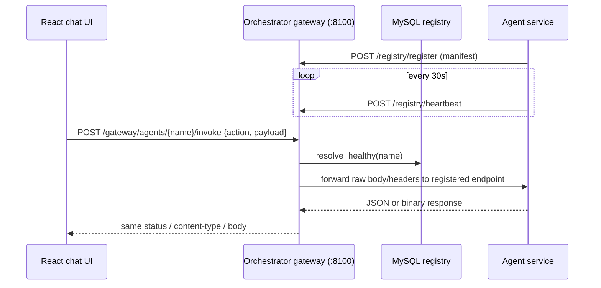

# Strategy F: Agent Integration Architecture

This document explains **Strategy F** — the pattern this repository uses to
plug an independently-deployed agent backend into the shared DigiDARA React
chat UI. It is the canonical reference for the pattern itself; see each
agent's own `agents/<name>/INTEGRATION.md` for agent-specific detail, and the
root [README.md](README.md) for full setup/run instructions.

Three agents currently use Strategy F:

- **Capstone Project Agent** (`agents/project_AI_Agent`, FastAPI + MySQL)
- **CodeForge (LeetCode/DSA) Agent** (`agents/codeforge_agent`, Flask + MySQL)
- **Communication Coach Agent** (`agents/communication-ai-agent`, Flask + MySQL)

## 1. The name

"Strategy F" = **REST + Registry + Gateway**. It's one of several ways an
agent could have been integrated (e.g. embedding agent code directly into the
orchestrator, or giving each agent its own standalone frontend). This repo
settled on Strategy F because it lets every agent stay an independently
deployable service, with **zero orchestrator code changes** required to add
another one.

## 2. Core idea

The browser never knows an agent's real host or port — only its **logical
name** (e.g. `capstone_project_agent`, `codeforge_agent`). Three moving parts
make that possible:



1. **Self-registration.** On startup, the agent POSTs its `manifest.json` to
   the orchestrator (`/registry/register`) and then heartbeats every
   `HEARTBEAT_INTERVAL_SECONDS` (default 30s) via `/registry/heartbeat`. On
   graceful shutdown it best-effort `DELETE /registry/deregister`s.
2. **The registry.** A MySQL table (`agent_registry`) keyed by
   `(agent_name, version)`, storing `endpoint`, `last_heartbeat`, `status`.
   If heartbeats stop (crash, no graceful shutdown), the row simply ages out
   past `HEARTBEAT_TTL_SECONDS` (default 90s) and the agent silently drops
   out of routing — no manual cleanup needed.
   See `agents/orchestrator/app/registry/service.py`, which enforces the
   rule that **no agent name is ever hardcoded** in the orchestrator.
3. **The gateway.** One generic FastAPI route,
   `POST /gateway/agents/{agent_name}/invoke`
   (`agents/orchestrator/app/gateway/routes.py`). It resolves the freshest
   healthy endpoint for `agent_name` from the registry and forwards the
   request **byte-for-byte, unparsed** — body and `Content-Type` preserved.
   This is deliberate: it's what lets multipart file/audio uploads pass
   through with zero gateway-side special-casing. Returns `503` if the agent
   is unregistered or its heartbeat is stale, `502` if the forward fails.

Because routing is purely name-driven, **adding a new agent needs no
orchestrator changes at all.**

## 3. The common `/api/invoke` contract

Every Strategy F agent exposes one endpoint:

```text
POST /api/invoke
Content-Type: application/json (or multipart/form-data for file uploads)

{
  "action": "...",
  "payload": { ... }
}
```

- A `health` action with an empty payload is **mandatory** — used for
  gateway-forwarded liveness checks and returns
  `{"status": "ok", "agent_name": "..."}`.
- Binary responses (PDF export, etc.) forward the internal response's
  status/content-type/content-disposition/body as-is.
- Every agent also implements an **identity-bridge action** (Capstone bridges
  identity through its normal signup flow; CodeForge uses `ensure_session`)
  that turns DigiDARA's dev-mode login (name/email) into whatever identity
  concept the underlying backend already uses — usually with no explicit DB
  write, since the vendored "create user" path already lazily creates that
  row on first use.

## 4. What every Strategy F agent must implement

| Piece | Purpose |
|---|---|
| `manifest.json` | Registry identity: `agent_name`, `version`, `host`/`port`/`path`, `input_schema` (the `action` enum) |
| `integration/registry_client.py` | Self-registration + heartbeat loop + best-effort deregister |
| `/api/invoke` dispatcher | Routes `{action, payload}` to real backend logic |
| Frontend wiring | Agent card, gateway API client, chat flow, dashboard, `App.tsx` state |

### `manifest.json`

```json
{
  "agent_name": "codeforge_agent",
  "version": "v1.0.0",
  "description": "...",
  "owner": "DigiDARA",
  "plan_tier": "free",
  "host": "127.0.0.1",
  "port": 4000,
  "path": "/api/invoke",
  "input_schema": {
    "type": "object",
    "properties": {
      "action": { "type": "string", "enum": ["health", "ensure_session", "..."] },
      "payload": { "type": "object" }
    },
    "required": ["action"]
  },
  "output_schema": { "type": "object" }
}
```

### `integration/registry_client.py`

Every agent ports the same small module, adapted to its web framework:

- **FastAPI** (Capstone): async, hooked into the app's lifespan context.
- **Flask** (CodeForge): synchronous `requests` client + a daemon heartbeat
  thread, since Flask has no async lifespan hook. Reads its own
  `manifest.json`, `POST`s `/registry/register`, then loops
  `/registry/heartbeat`, and registers an `atexit` hook for best-effort
  deregistration. Guard `start()` so it's idempotent — needed when a dev
  auto-reloader (e.g. Flask's) re-imports the app process.

Wire contract against the orchestrator (`/registry/register`,
`/registry/heartbeat`, `/registry/deregister`) is **identical across every
agent** — this file is copy-and-adapt, not agent-specific design.

### `/api/invoke` dispatcher — shapes seen so far

This is where implementations genuinely differ, based on how the underlying
backend was originally structured:

| Agent | Dispatcher shape | Why |
|---|---|---|
| **Capstone** | Hand-written `action → payload-taking function` map | Original code already took plain payload dicts |
| **CodeForge** | Additive surface alongside existing HMAC-signed routes | Every *existing* route (`/api/auth/*`, `/api/coding/*`) requires a signed request envelope (`X-CodeForge-Timestamp/Request-Id/Signature/Session` headers) that the gateway can't produce — it only forwards `Content-Type` and the raw body, never signs anything. `/api/invoke` instead requires an unguessable, revocable, expiring `sessionToken` inside the JSON `payload`, obtained once via `ensure_session` and checked against `student_sessions` on every other call — the same real auth check `require_student` already performs, just carried in the body instead of a header |
| **Communication Coach** | Re-enter the app's own routes via an in-process test client | ~45 pre-existing routes across 8 Flask blueprints read `request.get_json()`/`request.args`/`request.files` directly and are protected by `flask_jwt_extended`'s `@jwt_required()`, which reads a JWT from the `Authorization` header the gateway never forwards. Hand-porting each into a payload-taking function would mean re-implementing ~4,000 lines of route logic; instead `/api/invoke` calls `current_app.test_client()` against a static `{action: (method, path)}` map, attaching the payload's `authToken` (a JWT minted by the `bridge_identity` identity-bridge action) as a normal `Authorization: Bearer` header |

The third shape — re-entering the app's *own* routes unmodified via an
in-process test client (`current_app.test_client()` in Flask) using a static
`{action: (method, path)}` map, rather than duplicating that route logic —
is what the Communication Coach agent above uses. Prefer it whenever a
backend's existing routes read the request object directly instead of
exposing separate payload-taking functions, especially when there are too
many routes to hand-port reasonably.

Pick the shape that avoids duplicating existing route logic: hand-write a
map only when the backend already exposes payload-taking functions;
re-enter the app's own routes via a test client when it doesn't; and treat
`/api/invoke` as a parallel auth surface (not a bypass) when the existing
routes have a signing/session scheme the gateway structurally cannot satisfy.

### Frontend wiring

All in the shared React app at the repo root:

| File | Role |
|---|---|
| `src/data/agents.ts` | Adds the agent card with a `kind` discriminator |
| `src/lib/<agent>Api.ts` | Thin gateway client — `POST /gateway/agents/{name}/invoke` |
| `src/lib/<agent>Flow.ts` | In-chat conversational state machine mapping clicks/input to `action`/`payload` calls |
| `src/components/<Agent>Dashboard.tsx` | Right-side panel (progress, scorecard, ATS score, etc.) |
| `src/App.tsx` | Per-agent chat state, health polling, dashboard mounting |
| `src/index.css` | Agent-specific UI styles |
| `.env` | `VITE_GATEWAY_API_URL` + one `VITE_<AGENT>_AGENT_NAME` per agent |

## 5. Recipe: adding a new agent via Strategy F

1. Write `manifest.json` (name, version, host/port/path, action enum).
2. Port `integration/registry_client.py` for your framework; wire
   `start()`/`stop()` into app boot/shutdown; guard against double-start if
   your framework has a dev auto-reloader.
3. Implement `/api/invoke`:
   - Hand-write an action map if your routes already take payload dicts.
   - Re-enter your own routes via an in-process test client
     (`{action: (method, path)}`) if they read the request object directly.
   - If existing routes require signed/session-bound requests the gateway
     can't produce, add `/api/invoke` as a parallel surface with its own
     equivalent-strength check (e.g. a session token carried in the body).
4. Add the mandatory `health` action and, if the backend needs one, an
   identity-bridge action (e.g. `ensure_session`).
5. Exempt `/api/invoke` from CSRF/cookie-based auth if your framework
   enforces it — the gateway never forwards browser cookies, so
   cookie-authenticated middleware will otherwise reject every
   gateway-forwarded call.
6. Configure `.env`: `ORCHESTRATOR_URL`, `AGENT_PUBLIC_URL` (must be
   reachable *from* the orchestrator process — never `127.0.0.1` across
   separate containers), `HEARTBEAT_INTERVAL_SECONDS`.
7. Wire the frontend: agent card, gateway API client, chat flow, dashboard
   component, `App.tsx` state.
8. Verify:
   ```powershell
   # Registered and healthy
   Invoke-RestMethod "http://127.0.0.1:8100/registry/agents?healthy_only=true"

   # Gateway-forwarded health check
   $body = @{ action = "health"; payload = @{} } | ConvertTo-Json
   Invoke-RestMethod `
     -Uri "http://127.0.0.1:8100/gateway/agents/<agent_name>/invoke" `
     -Method Post -ContentType "application/json" -Body $body
   # Expect: {"status":"ok","agent_name":"<agent_name>"}
   ```
9. Write `agents/<name>/INTEGRATION.md` documenting the dispatcher shape and
   any quirks, and update the root `README.md`'s service table, ports,
   action tables, and files-changed section.

## 6. Known cross-cutting limitations

- Login/signup is a `localStorage` development experience, not production
  authentication — the whole identity-bridge mechanism exists because of
  this.
- CORS currently allows all origins; should be restricted for production.
- Any dev-only identity bridge (header- or token-carried) should explicitly
  refuse to activate when the agent detects a production environment.
- Rate limiting keyed on session/remote-address collapses to one shared
  bucket per endpoint for all gateway-forwarded traffic, since `/api/invoke`
  calls made through an in-process test client never carry a browser session
  cookie. Affects abuse-throttling headroom only, not correctness.
- Production deployments should add authentication/authorization to the
  registry mutation and gateway invocation endpoints themselves — today any
  process that can reach the orchestrator can register as any agent name.

## 7. Reference implementations

- `agents/orchestrator/app/gateway/routes.py` — the generic forwarding route
- `agents/orchestrator/app/registry/service.py` — registry CRUD + health
  filtering (the "no hardcoded agent name" rule lives here)
- `agents/project_AI_Agent/app/integration/registry_client.py` — the
  FastAPI/async self-registration/heartbeat client
- `agents/codeforge_agent/services/lms-api/integration/registry_client.py` —
  the Flask-flavored self-registration/heartbeat client
- `agents/codeforge_agent/INTEGRATION.md` — the parallel-auth-surface
  pattern for a backend with pre-existing signed requests
- `agents/communication-ai-agent/backend/integration/registry_client.py` —
  another Flask-flavored self-registration/heartbeat client
- `agents/communication-ai-agent/backend/app/routes/invoke.py` — the
  test-client re-entry dispatcher pattern
- `agents/communication-ai-agent/INTEGRATION.md` — why re-entry was chosen
  over a hand-written action map for this agent
